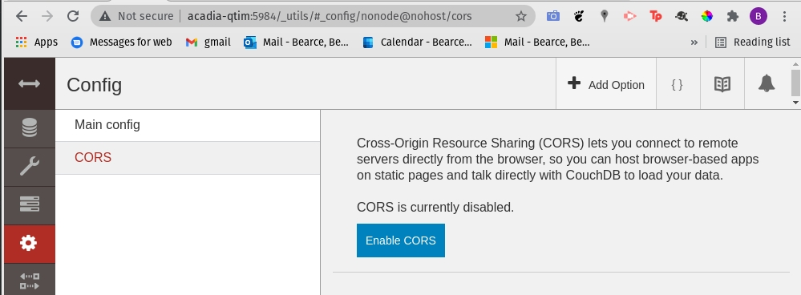
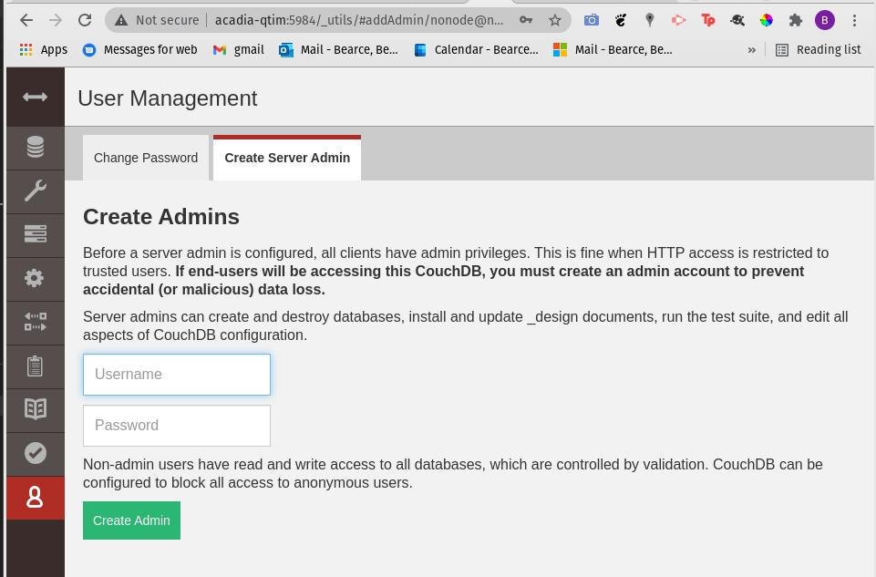

### Setting up Image-Comparator in a Docker container

The dockerfile will automatically create a docker image for the Image-Comaparator. A docker image can be run as a virtual linux system, which will be used to deploy the web server. Once the docker image is built and run, the admin can insert custom image datasets and create image classify/compare tasks.

Clone github directory:
```
WORKING_DIR=$PWD
cd $WORKING_DIR
git clone https://github.com/QTIM-Lab/Image-Comparator.git
cd Image-Comparator
```

To build the docker images, run the following command:
```
cd Image-Comparator-Dockerfiles # be in the correct directory

CONTAINER_NAME=image-comparator
CONTAINER_TAG=latest
docker build . -t $CONTAINER_NAME:$CONTAINER_TAG
```

Now run container:
```
cd ../ # Return to main directory

WEB_APP_PORT=8080
docker run \
 --rm \
 -d \
 -v $WORKING_DIR:$WORKING_DIR \
 -w $WORKING_DIR/Image-Comparator \
 -p $WEB_APP_PORT:$WEB_APP_PORT \
 --name $CONTAINER_NAME \
 $CONTAINER_NAME:$CONTAINER_TAG
```

To stop container (if needed):
```
docker stop image-comparator
```

### Deploy couchdb docker image
Decide on a place to store the couchdb data. ```/opt/couchdb/data``` is where a normal couchdb installs will store data so don't use this directory in a docker mount unless you don't have couchdb installed on the machine already.
```
mkdir -p /opt/couchdb/data # if it doesn't exist already

COUCHDB_USER=admin
COUCHDB_PASSWORD=password
COUCH_PORT=5984

docker run \
 -p $COUCH_PORT:$COUCH_PORT \
  --network="host"  \
 --name image-comparator-couchdb \
 -v /opt/couchdb/data:/opt/couchdb/data \
 -d \
 -e COUCHDB_USER=$COUCHDB_USER \
 -e COUCHDB_PASSWORD=$COUCHDB_PASSWORD \
 couchdb:latest
```

> Note you can't make requests to this container wihtout making sure that CORS (cross-origin resource sharing) is enabled:

Once logged into couchdb goto settings to enable CORS:



Create an Admin (if you delete them):


Debugging...

To shell into this container:
```
docker exec -it image-comparator-couchdb bash
```

To stop container (if needed):
```
docker stop image-comparator-couchdb
```

### Setting up Image-Comparator in a Docker Container Using Flask

We will be using the *Dockerfile_flask* file in ```Image-Comparator-Dockerfiles```.

#### Build the container

Build a new image for flask and serve in the context of the flask_server folder:
```bash
cd Image-Comparator-Dockerfiles
CONTAINER_NAME=image-comparator
CONTAINER_TAG=flask

docker build . -f Dockerfile_flask -t $CONTAINER_NAME:$CONTAINER_TAG

cd ../

docker run \
  -it \
  --rm \
  -p 8081:8081 \
  --network="host"  \
  -v $PWD/flask_server:/flask_server \
  -v $PWD:$PWD \
  -w /flask_server \
  --name "$CONTAINER_NAME""-""$CONTAINER_TAG" \
  image-comparator:flask
```

#### Pip install requirements
```bash
pip3 install -r requirements.txt
```

#### Run flask server
```bash
flask run --port 8081 --host 0.0.0.0
```
